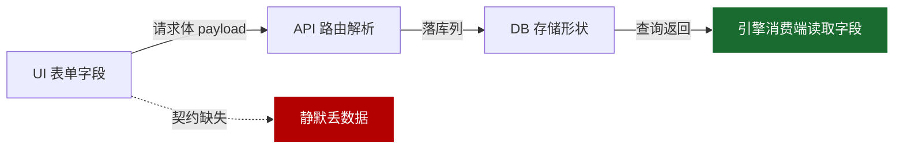

# 手动录入数据契约审计计划报告

> 生成时间: 2026/7/26 14:00:52  
> 覆盖手动录入模块: 8 个  
> 审计条目: 8 条  
> 风险分布: HIGH 4 / MEDIUM 3 / LOW 1

---

## 一、背景与目的

项目采用「分阶段独立开发」：手动录入端（UI 表单）与核心消费端（战斗引擎 / 结算服务）字段契约**全为隐式**。本次刚修复的「手动单位战斗数据全空」bug（form 平铺 → 后端只认 stats/skills/attributes）正是该债务的典型爆发点。本报告基于后端现有核心数据结构，**反向确权每个手动录入入口的权威保存格式**，并据此制定本审计计划，确保「录了就能被核心读到」。

## 二、审计方法论（四跳契约追踪）

对每个手动录入路径，串联四跳并逐跳对账：

**判定标准**：在 B→C、C→D 两跳中，凡出现「录入端写了 X，消费端读 Y，且无默认值兜底/无告警」的，即记为缺陷。

## 三、风险总览

| 风险 | 条目数 | 模块 |
| --- | --- | --- |
| 🔴 HIGH | 4 | 机甲单位编辑器 / 战场 / 地形编辑器 / 自定义阵营 / 胜利条件配置 |
| 🟡 MEDIUM | 3 | 词条 / 技能编辑器 / 部署单位池 / Royroy 浮游辅机 |
| 🟢 LOW | 1 | 王牌机体配置 |

---

## 四、权威保存格式（Schema 真相表）

### 机甲单位 Unit

- **录入入口 UI**: NewUnitEditorView.vue → saveUnit → buildUnitPayload(form)
- **API**: `POST /api/units`
- **落库**: units 表 (stats[JSON], skills[JSON], attributes[JSON], name, faction, codename, unit_code, type, owner_id, owner_name, import_source, is_public_copy, is_public, royalty, created_at)
- **核心消费端**: createBattleUnit(state, rawUnit) — 读取 stats/skills/attributes 构造 BattleUnit

**顶层字段**

- **unit_code** `string`  _(必填)_
  - 说明: 唯一单位编码，如 "Unit-001"
- **name** `string`  _(必填)_
- **codename** `string`  _(可选)_
- **faction** `string`  _(必填)_  枚举: `earth` / `maxion` / `balon` / `neutral`
  - 消费端: factionSkillRegistry.getFactionSkills()
- **type** `string`  _(必填)_  枚举: `机体` / `载具` / `背包兵` / `其他`
- **owner_id** `number`  _(必填)_
- **owner_name** `string`  _(可选)_
- **import_source** `string`  _(可选)_  默认: `"manual"`
- **stats** `object`  _(必填)_
  - 说明: 战斗数值唯一真相
  - 消费端: BattleUnit.currentStats / maxStats
- **skills** `array`  _(可选)_  默认: `[]`
  - 说明: UnitSkill[]
  - 消费端: createBattleUnit 展开为 unit.skills
- **attributes** `object`  _(必填)_
  - 说明: 部件/阵营技能/装备/royroy
  - 消费端: createBattleUnit 读取 parts/factionSkills/equipment/royroy

**嵌套: `stats`**

- **hp** `number`  _(必填)_
  - 消费端: damagePipe / victoryChecker(annihilate)
- **maxHp** `number`  _(必填)_
- **armor** `number`  _(必填)_
  - 消费端: damagePipe 减伤
- **shield** `number`  _(可选)_  默认: `0`
- **attack** `number`  _(必填)_
  - 消费端: skillExecutor 攻击结算
- **defense** `number`  _(必填)_  默认: `0`
  - 说明: 已废弃，保留兼容
- **speed** `number`  _(必填)_
  - 说明: 可移动格数
  - 消费端: move 范围
- **mobility** `number`  _(必填)_
  - 说明: 仅机体机动
- **range** `number`  _(必填)_
  - 消费端: attackRange 计算
- **min_range** `number`  _(可选)_  默认: `1`

**嵌套: `skills[] (UnitSkill)`**

- **id** `string`  _(必填)_
- **name** `string`  _(必填)_
- **description** `string`  _(可选)_
- **script** `string`  _(可选)_
- **cooldown** `number`  _(可选)_  默认: `0`
  - 消费端: skillRegistry 冷却
- **currentCooldown** `number`  _(可选)_  默认: `0`
- **energyCost** `number`  _(可选)_  默认: `0`
- **damageType** `string`  _(可选)_  枚举: `kinetic` / `beam` / `explosive` / `corrosive` / `thermal`

**嵌套: `attributes (parts/factionSkills/equipment/royroy)`**

- **parts** `object`  _(必填)_
  - 说明: 部件槽位对象，键见 partOrder
  - 消费端: createBattleUnit 注入 unit.parts
- **skills_by_owner** `object`  _(可选)_  默认: `{}`
- **factionSkills** `array`  _(可选)_  默认: `[]`
  - 说明: 阵营技能 id 列表
  - 消费端: createBattleUnit 合并入 skills
- **stance** `string`  _(可选)_
- **equipment** `object`  _(可选)_
  - 说明: 3 槽位 {left_hand,right_hand,other}，每槽 {damage_kind_modifiers:{kinetic,beam,explosive,corrosive}}
  - 消费端: move/attack 减伤
- **royroy** `object`  _(可选)_
  - 说明: Royroy 辅机模型（见 royroy schema）

**嵌套: `attributes.parts (键 = 主机体/跟随/左手/右手/其它)`**

- **type** `string`  _(必填)_
- **normalizedType** `string`  _(必填)_
  - 消费端: createBattleUnit 判断背包/防具额外HP
- **slot** `string`  _(必填)_
- **structure** `number`  _(可选)_
- **durability** `number`  _(可选)_
  - 消费端: 背包/防具独立 HP
- **hp** `number`  _(可选)_
- **maxHp** `number`  _(可选)_
- **attack** `number`  _(可选)_
- **defense** `number`  _(可选)_
- **mobility** `number`  _(可选)_
- **skills** `array`  _(可选)_  默认: `[]`

### 战场 / 地形 Battlefield

- **录入入口 UI**: NewBattlefieldView.vue → saveMap → {cells, spawn_points, attributes}
- **API**: `POST /api/map/battlefields`
- **落库**: maps 表 (name, width, height, cells[JSON], spawn_points[JSON], attributes[JSON], is_public_copy, is_public, review_status, generation_status)
- **核心消费端**: buildTerrainMap(state) — 仅读 c.terrain；spawn_points 用于布阵；terrainCost/terrainDefense 查静态表

**顶层字段**

- **name** `string`  _(必填)_
- **width** `number`  _(可选)_  默认: `100`
- **height** `number`  _(可选)_  默认: `100`
- **cells** `array`  _(必填)_
  - 说明: 六角格数组；引擎只读 c.terrain
  - 消费端: buildTerrainMap
- **spawn_points** `array`  _(可选)_  默认: `[]`
  - 说明: 出生点 {q,r,faction?}
- **attributes** `object`  _(可选)_  默认: `{}`
- **is_public_copy** `boolean`  _(可选)_  默认: `false`
- **is_public** `boolean`  _(可选)_  默认: `false`
- **review_status** `string`  _(可选)_  默认: `"pending"`
- **generation_status** `string`  _(可选)_  默认: `"complete"`

**嵌套: `cells[]`**

- **q** `number`  _(必填)_
  - 说明: Even-R offset 列坐标
- **r** `number`  _(必填)_
  - 说明: Even-R offset 行坐标
- **terrain** `string`  _(必填)_  枚举: `moon` / `mountain` / `forest` / `fortress` / `ruins` / `crystal` / `rubble` / `city_building` / `open` / `water`
  - 说明: 地形 ID；须命中静态 terrain 表才享减伤/移动成本
  - 消费端: buildTerrainMap → defense_bonus / terrainCost

**嵌套: `spawn_points[]`**

- **q** `number`  _(必填)_
- **r** `number`  _(必填)_
- **faction** `string`  _(可选)_  枚举: `earth` / `maxion` / `balon` / `neutral`

### 阵营 Faction

- **录入入口 UI**: NewPreparationRoom.vue 阵营编辑 / 后端 /generate
- **API**: `POST /api/units/factions`
- **落库**: factions 表 (id, name, code, logo_url, created_at, updated_at)  ★无 skills 列
- **核心消费端**: factionSkillRegistry.getFactionSkills(faction) — 从【硬编码】FactionSkillRegistry 读取，不读 DB
- **⚠️ 已知风险**: 自建阵营写入 factions 表后，引擎 getFactionSkills() 仍从硬编码对象（仅 earth/balon/maxion，不含 neutral）取技能，不读 DB → 自建阵营单位拿不到任何阵营技能。此外：未知 faction 当前被 getFactionSkills 返回 []（已安全）与 getFactionInfo 返回 null（已防御）兜底，无即时崩溃；但若未来任一逻辑段直接读取 FactionSkillRegistry[faction].color 或解构返回对象，未知 faction 会抛 TypeError 致 /attack 500。故不仅是「读不到」，还存在潜在「崩溃面」，必须加安全兜底锁封死。

**顶层字段**

- **code** `string`  _(必填)_
  - 说明: 阵营编码，唯一
- **name** `string`  _(必填)_
- **logo_url** `string`  _(可选)_

### 词条 / 技能 Skill

- **录入入口 UI**: GlossaryView.vue → configs 表
- **API**: `POST /config (key=glossary_skill_config)`
- **落库**: configs 表 (key, value[JSON]) — skills 为 id→对象 字典
- **核心消费端**: skillExecutor.cjs / skillRegistry.cjs — 仅认 action_type 五谓语 switch

**顶层字段**

- **id** `string`  _(必填)_
- **label** `string`  _(必填)_
- **type** `string`  _(必填)_  枚举: `active` / `passive`
- **category** `string`  _(必填)_  枚举: `melee` / `ranged` / `special` / `auto`
- **action_type** `string`  _(必填)_  枚举: `attack` / `heal` / `buff` / `debuff` / `passive`
  - 说明: ★唯一分派键；未知值落 default 静默失效
- **cast_range** `number`  _(必填)_
  - 说明: ★必须标量
- **min_cast_range** `number`  _(可选)_  默认: `0`
- **aoe_radius** `number`  _(可选)_  默认: `0`
- **base_damage** `number`  _(可选)_  默认: `0`
- **damage_kind** `string`  _(可选)_  枚举: `kinetic` / `beam` / `explosive` / `corrosive` / `thermal`  默认: `"kinetic"`
- **attack_stat** `string`  _(必填)_  枚举: `melee` / `ranged` / `max`
- **deterministic** `boolean`  _(可选)_  默认: `true`
- **requires_unmoved** `boolean`  _(可选)_  默认: `false`
- **requires_stealth** `boolean`  _(可选)_  默认: `false`
- **status_effects** `array`  _(可选)_  默认: `[]`
- **accuracy_mod** `number`  _(可选)_  默认: `0`
- **evasion_mod** `number`  _(可选)_  默认: `0`
- **height_bonus_per_diff** `number`  _(可选)_  默认: `0`
- **trigger** `string`  _(可选)_
  - 说明: ★死字段：被 _getUniversalFields 读出但无任何调度
- **description** `string`  _(可选)_

### 胜利条件 Victory Conditions

- **录入入口 UI**: NewPreparationRoom.vue → victory-conditions
- **API**: `POST /api/combat/:battleId/victory-conditions`
- **落库**: battles 表 victory_conditions[JSON] → state.victoryConditions (整包存 req.body)
- **核心消费端**: victoryChecker.evaluateVictory(state) — 实际只认 vc.facility 对象
- **⚠️ 已知风险**: ★真实活 bug（契约错位）：前端 destroy_facility 送 {target_q,target_r}、hold_position 送 {hold_round}；但 victoryChecker 读的是 vc.facility.{q,r,hp,faction,attacker}（L53/100/137）。字段名不匹配 → facility 恒为 null → destroy_facility 与 hold_position 永不触发（录了但读不到）。

**顶层字段**

- **conditions** `array`  _(必填)_  枚举: `annihilate` / `assassinate` / `destroy_facility` / `hold_position` / `capture`
  - 说明: 至少一个条件
- **hold_round** `number`  _(可选)_
  - 说明: hold_position 轮次（前端发送）
- **target_q** `number`  _(可选)_
  - 说明: 前端 destroy_facility 发送（但 victoryChecker 不读，须映射为 facility.q）
- **target_r** `number`  _(可选)_
  - 说明: 前端 destroy_facility 发送（须映射为 facility.r）
- **facility** `object`  _(可选)_
  - 说明: ★victoryChecker 真实期望：{q,r,hp,faction,attacker}；当前前端未发送 → 条件死链

**嵌套: `facility (victoryChecker 实际期望，须由前端/网关映射生成)`**

- **q** `number`  _(必填)_
  - 说明: 设施 offset 坐标（= 前端 target_q）
- **r** `number`  _(必填)_
  - 说明: 设施 offset 坐标（= 前端 target_r）
- **hp** `number`  _(可选)_  默认: `0`
  - 说明: destroy_facility 比对 hp<=0
- **faction** `string`  _(可选)_  枚举: `earth` / `maxion` / `balon` / `neutral`
  - 说明: hold_position 占据方
- **attacker** `string`  _(可选)_  枚举: `earth` / `maxion` / `balon` / `neutral`
  - 说明: destroy_facility 攻击方

### 王牌机体 ACE Unit

- **录入入口 UI**: NewPreparationRoom.vue → ace-unit
- **API**: `POST /api/combat/:battleId/ace-unit`
- **落库**: battles 表 ace_unit[JSON] → state.aceUnit
- **核心消费端**: combatResolver（王牌倍率 / 胜负判定）

**顶层字段**

- **faction** `string`  _(必填)_  枚举: `earth` / `maxion` / `balon` / `neutral`
- **unit_id** `string|number`  _(必填)_

### 部署单位池 Pending Units

- **录入入口 UI**: NewPreparationRoom.vue → pending-units
- **API**: `POST /api/combat/:battleId/pending-units`
- **落库**: battles 表 pending_units[JSON] → state.pendingUnits
- **核心消费端**: createBattleUnit / deploy 阶段

**顶层字段**

- **units** `array`  _(必填)_
  - 说明: 完整单位对象数组；equipment 须已 sanitize 为 3 槽位 damage_kind_modifiers

### Royroy 浮游辅机 (attributes.royroy 内嵌模型)

- **录入入口 UI**: 单位编辑器「跟随」部件 → buildUnitPayload 注入 royroy
- **API**: `随 Unit 保存 / 运行时 /action (deploy_royroy|retrieve_royroy|damage_royroy)`
- **落库**: units 表 attributes JSON 内 royroy 对象
- **核心消费端**: combat.ts /action 处理器 + move 自动重定位（读 deployed/status/q/r/hp/cooldownRound/isAuto）

**顶层字段**

- **deployed** `boolean`  _(必填)_  默认: `false`
- **status** `string`  _(必填)_  枚举: `inactive` / `deployed` / `destroyed`
- **q** `number`  _(可选)_
  - 说明: 部署后坐标
- **r** `number`  _(可选)_
- **hp** `number`  _(必填)_  默认: `0`
- **maxHp** `number`  _(必填)_  默认: `0`
- **cooldownRound** `number`  _(可选)_  默认: `0`
- **isAuto** `boolean`  _(可选)_  默认: `false`
  - 说明: auto 类：主机移动后自动重定位
- **faction** `string`  _(可选)_  枚举: `earth` / `maxion` / `balon` / `neutral`
  - 说明: ★阵营继承：部署时由母机透传，确保友军/敌军识别正确
- **ownerId** `number`  _(可选)_
  - 说明: ★归属玩家继承：部署时由母机透传

---

## 五、审计计划（逐入口四跳 + 必查契约点）

#### A1 · 机甲单位编辑器  _[HIGH]_

- **模块**: `unit` (机甲单位 Unit)
- **四跳链路**:
  1. UI 录入: NewUnitEditorView.vue (saveUnit→buildUnitPayload)
  2. API 路由: `POST /api/units`
  3. 落库形状: units 表 (stats[JSON], skills[JSON], attributes[JSON], name, faction, codename, unit_code, type, owner_id, owner_name, import_source, is_public_copy, is_public, royalty, created_at)
  4. 核心消费: createBattleUnit / skillExecutor / combatResolver
- **问题/历史坑**: 历史 bug：平铺表单整包发出，后端只认 stats/skills/attributes → 手动单位战斗数据全空（已修复为 buildUnitPayload 同构打包）。射程断层（二次断层）：过去 range 仅存 currentStats.range 嵌套层，前端 selectedUnit.range（顶层）读不到 → 普通攻击被压成距离 1；已于 2026-07-24 在 createBattleUnit L134 提升顶层 range 修复，currentStats.range 在 L110 保留。本条作为回归守卫。
- **必查契约点** _(8)_:
  1. buildUnitPayload 输出字段名 == createBattleUnit 读取字段名（stats.* / skills[] / attributes.parts / factionSkills / equipment / royroy）
  2. stats 必填项完整（hp/maxHp/armor/attack/defense/speed/mobility/range）
  3. skills[].id/name/cooldown/energyCost 与 UnitSkill 一致
  4. attributes.parts 键集合 == {主机体,跟随,左手,右手,其它}
  5. equipment 3 槽位 damage_kind_modifiers 键集合 == {kinetic,beam,explosive,corrosive}
  6. faction 命中 factionSkillRegistry 或标注「自建阵营无技能」
  7. royroy 模型字段齐全（deployed/status/hp/maxHp/cooldownRound/isAuto）
  8. 必查项8（射程二次断层回归守卫）：createBattleUnit 已提升顶层 unit.range（L134）且保留 currentStats.range（L110）；网关 /attack 普通攻击走 casterUnit.currentStats?.range（L902）。须确保两者双向同步、currentStats.range 必填，防止回归为「录入 range=3 仅打 1 格」。
- **兜底行为**: createBattleUnit 对缺字段有 try/catch 兜底 + 默认值，但字段错位会静默丢数据
- **权威格式引用**: unit schema

#### A2 · 战场 / 地形编辑器  _[HIGH]_

- **模块**: `battlefield` (战场 / 地形 Battlefield)
- **四跳链路**:
  1. UI 录入: NewBattlefieldView.vue (saveMap)
  2. API 路由: `POST /api/map/battlefields`
  3. 落库形状: maps 表 (name, width, height, cells[JSON], spawn_points[JSON], attributes[JSON], is_public_copy, is_public, review_status, generation_status)
  4. 核心消费: buildTerrainMap / terrainCost / terrainDefense
- **问题/历史坑**: 引擎只读 c.terrain；后端兼容 cells 数组或 terrain 字典两种格式，resolveTerrainId 从值里挖 terrain_id/terrain/id/type。若前端送出 terrain_id 而非 terrain → 静默回退 moon。自定义地形 move_cost/defense_bonus 若不命中静态 terrain 表则无效。
- **必查契约点** _(7)_:
  1. saveMap 送出的 cells[].terrain 字段名 == buildTerrainMap 读取的 c.terrain
  2. terrain 值 ∈ ENUM.terrain（命中静态表才享减伤/移动成本）
  3. spawn_points 的 q,r 与 cells 坐标体系一致（Even-R offset）
  4. 自定义地形 move_cost/defense_bonus 是否真被 terrainCost/terrainDefense 读取（而非仅 UI 展示）
  5. width/height 与实际 cells 范围匹配
  6. 坐标 Key 一致性（防月面回退）：buildTerrainMap 用 `${q},${r}`（L45），skillExecutor 地形读取用 `${target.q},${target.r}`（L335）/ `cellQ+","+cellR`（L1154），前端 hexKey=`${q},${r}`（L1955），getHexKey 亦 `${q},${r}`——当前均逗号分隔一致，无 `3_4` 类拼写漂移；建议统一收敛到单一 getHexKey(q,r) 函数，杜绝未来坐标格式分裂导致地形 Key 命中失败、回退 moon。
  7. 距离计算体系：Even-R offset→Axial/Cube 由 hexDistanceOffset（combat.ts）统一转换；确认引擎地形查找与距离/ZOC 判定使用的是同一套 offset 坐标，未误混入 axial 坐标做 Key。
- **兜底行为**: buildTerrainMap 默认 c.terrain||"moon" → 地形静默丢失为无减伤月面
- **权威格式引用**: battlefield schema

#### A3 · 自定义阵营  _[HIGH]_

- **模块**: `faction` (阵营 Faction)
- **四跳链路**:
  1. UI 录入: 整备室阵营编辑 / POST /api/units/factions
  2. API 路由: `POST /api/units/factions`
  3. 落库形状: factions 表 (id, name, code, logo_url, created_at, updated_at)  ★无 skills 列
  4. 核心消费: factionSkillRegistry.getFactionSkills()
- **问题/历史坑**: factions 表无 skills 列；引擎从硬编码 FactionSkillRegistry（仅 earth/balon/maxion，不含 neutral）取技能，不读 DB。自建阵营单位拿不到任何阵营技能。此外：未知 faction 当前被 getFactionSkills 返回 []（已安全，无即时崩溃）与 getFactionInfo 返回 null（已防御）兜底；但若未来任一逻辑段直接读取 FactionSkillRegistry[faction].color 或解构返回对象，未知 faction 会抛 TypeError 致 /attack 500。故不仅是「读不到」，还存在潜在「崩溃面」，必须加安全兜底锁封死。
- **必查契约点** _(4)_:
  1. factions 表是否应增加 skills 列以持久化阵营技能
  2. factionSkillRegistry 是否改造为运行时从 DB 动态加载（含自建阵营）
  3. 安全兜底锁（关键）：getFactionSkills(faction) 未知 → 返回 []（保持数组类型，勿改对象以免破坏 .forEach 调用）；getFactionInfo(faction) 未知 → 返回 {id: faction, skills: [], buff: {}}（而非 null），防止未来 .color / .id 访问崩溃
  4. 确认硬编码 FACTION_IDS 仅 earth/balon/maxion；neutral/未知 亦被视作无技能（须与前端 FACTION_CONFIG.unknown 兜底对齐）
- **兜底行为**: 当前：getFactionSkills 未知→[]（安全，功能缺失）；getFactionInfo 未知→null（需改造为安全结构）。真正架构缺口：factions 表技能不进引擎；未知 faction 在未来代码路径存在崩溃面，须以安全兜底锁封死。
- **权威格式引用**: faction schema

#### A4 · 词条 / 技能编辑器  _[MEDIUM]_

- **模块**: `skill` (词条 / 技能 Skill)
- **四跳链路**:
  1. UI 录入: GlossaryView.vue (POST /config)
  2. API 路由: `POST /config`
  3. 落库形状: configs 表 (key, value[JSON]) — skills 为 id→对象 字典
  4. 核心消费: skillExecutor / skillRegistry
- **问题/历史坑**: admin-only，深度合入 cfg.skills。危险点：action_type 是唯一分派键，UI 若新增未知 action_type 会静默失效；trigger 为死字段；cast_range 必须标量。
- **必查契约点** _(5)_:
  1. action_type ∈ {attack,heal,buff,debuff,passive}，未知值须拦截
  2. cast_range 为标量数值（非对象）
  3. category 用容错值 auto/special（battleStateFactory isAuto 硬依赖 auto）
  4. damage_kind_modifiers / status_effects 字段名与 skillExecutor 读取一致
  5. trigger 字段明确标注「不可调度」避免误用
- **兜底行为**: 未知 action_type 落 default 仅返回 bonus_value 无副作用（静默失效）
- **权威格式引用**: skill schema

#### A5 · 胜利条件配置  _[HIGH]_

- **模块**: `victoryConditions` (胜利条件 Victory Conditions)
- **四跳链路**:
  1. UI 录入: NewPreparationRoom.vue → victory-conditions
  2. API 路由: `POST /api/combat/:battleId/victory-conditions`
  3. 落库形状: battles 表 victory_conditions[JSON] → state.victoryConditions (整包存 req.body)
  4. 核心消费: victoryChecker.evaluateVictory
- **问题/历史坑**: ★真实活 bug（契约错位，比原 MEDIUM 更严重）：前端 destroy_facility 送 {target_q,target_r}、hold_position 送 {hold_round}；但 victoryChecker（L53/100/137）读的是 vc.facility.{q,r,hp,faction,attacker}。字段名不匹配 → facility 恒为 null → destroy_facility 与 hold_position 永不触发（典型"录了但读不到"）。坐标比对本身一致：hold_position 用 unit.position.{q,r}（offset）== facility.{q,r}（offset），无轴向混用；但须确保 facility 字段真正落地且统一用 offset 坐标。
- **必查契约点** _(4)_:
  1. conditions ∈ ENUM.victoryCondition 且非空
  2. ★契约对齐：前端 target_q/target_r 须在落库或网关处映射为 victoryConditions.facility.{q,r}；hold_round 条件须同时生成 facility.{faction,hp,attacker}，或改 victoryChecker 直接读 target_q/target_r
  3. 坐标同一把尺子：victoryChecker 比对须用 offset 坐标（unit.position.{q,r} 与 facility.{q,r} 同为 Even-R offset），调用统一 getHexKey/hexDistanceOffset，禁止轴向坐标直接 ==
  4. evaluateVictory 对 destroy_facility 实际比对 facility.hp<=0、对 hold_position 比对 u.q===fq && u.r===fr，确认无坐标体系错配
- **兜底行为**: 现网：facility 为 null → destroy_facility/hold_position 永不触发胜利（条件死链，非崩溃）
- **权威格式引用**: victoryConditions schema

#### A6 · 王牌机体配置  _[LOW]_

- **模块**: `aceUnit` (王牌机体 ACE Unit)
- **四跳链路**:
  1. UI 录入: NewPreparationRoom.vue → ace-unit
  2. API 路由: `POST /api/combat/:battleId/ace-unit`
  3. 落库形状: battles 表 ace_unit[JSON] → state.aceUnit
  4. 核心消费: combatResolver（王牌倍率/胜负）
- **问题/历史坑**: faction 须合法；unit_id 须指向 pending_units 中存在的单位。
- **必查契约点** _(2)_:
  1. faction ∈ ENUM.faction
  2. unit_id 存在于 pending_units
- **兜底行为**: 缺失 → 无王牌加成
- **权威格式引用**: aceUnit schema

#### A7 · 部署单位池  _[MEDIUM]_

- **模块**: `pendingUnits` (部署单位池 Pending Units)
- **四跳链路**:
  1. UI 录入: NewPreparationRoom.vue → pending-units
  2. API 路由: `POST /api/combat/:battleId/pending-units`
  3. 落库形状: battles 表 pending_units[JSON] → state.pendingUnits
  4. 核心消费: createBattleUnit / deploy
- **问题/历史坑**: units[] 须为完整 Unit 形状（含 stats/skills/attributes）；equipment 须已 sanitize 为 3 槽位 damage_kind_modifiers，否则 deploy 时减伤缺失。
- **必查契约点** _(3)_:
  1. units[] 复用 unit schema 全字段校验
  2. equipment 与 unit schema 一致
  3. 同 unit_code 去重
- **兜底行为**: 缺 equipment → 减伤失效；缺 stats → createBattleUnit 兜底默认值
- **权威格式引用**: pendingUnits schema

#### A8 · Royroy 浮游辅机  _[MEDIUM]_

- **模块**: `royroy` (Royroy 浮游辅机 (attributes.royroy 内嵌模型))
- **四跳链路**:
  1. UI 录入: 单位编辑器「跟随」部件 → buildUnitPayload
  2. API 路由: `随 Unit 保存`
  3. 落库形状: units 表 attributes JSON 内 royroy 对象
  4. 核心消费: combat.ts /action (deploy/retrieve/damage_royroy) + move 自动重定位
- **问题/历史坑**: royroy 内嵌于 attributes。若 buildUnitPayload 未注入 isAuto/deployed/status/hp/maxHp/cooldownRound，则 /action 部署会 400「该单位无 Royroy」或字段缺失。
- **必查契约点** _(4)_:
  1. buildUnitPayload 注入完整 royroy 模型（deployed/status/hp/maxHp/cooldownRound/isAuto）
  2. ★阵营继承：royroy 实体须携带并继承母机 faction/ownerId（部署时由 combat.ts /action 透传），确保友军/敌军/归属识别逻辑（含未来可能将 royroy 纳入 AoE/ZOC 目标集合）正确
  3. isAuto 与 category=auto 词条门控一致
  4. deploy_royroy 校验 q/r 相邻 + 占用格
- **兜底行为**: roy 不存在 → 400 NO_ROYROY；字段缺失 → 部署异常
- **权威格式引用**: royroy schema

---

## 六、执行路线与交付物

1. **Phase 1（本脚本产出）**：建立 8 个模块的权威 Schema 真相表，作为一切录入/消费的基准契约。
2. **Phase 2（逐入口修复）**：按风险排序 HIGH→LOW，对 A1（单位，已修复）/ A2（战场）/ A3（阵营）/ A4（词条）逐一落地字段对齐。
3. **Phase 3（契约测试）**：为每条路径补 round-trip 测试（录入 → 落库 → 引擎读取），防止复发。
4. **Phase 4（E2E 验证）**：浏览器开真实战局，验证地形减伤 / 阵营技能 / 胜利遮罩 / Royroy 部署。

### 交付物

- 结构化审计对象（normalized）：可供测试/CI 复用的 JSON 契约。
- 本报告（Markdown）：保存至用户桌面。

---

_本报告由 `scripts/manual-input-audit.cjs` 基于后端核心数据结构自动生成。_
